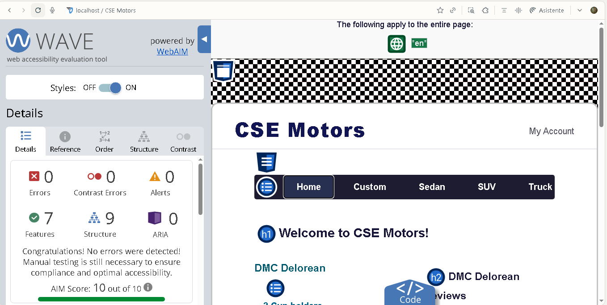

CSE340 Motors Project

Overview

This project is a fully responsive, accessible web application built with Node.js, Express, and EJS templating for the CSE340 course.
It replicates a car dealership homepage—complete with modular views, partials, and accessibility best practices.

Getting Started

This document will help you launch and explore this backend-driven Node.js application with Express/EJS templates and all the project dependencies.

Prerequisites

* Git (for version control)

* Node.js (preferably LTS version)

* VS Code (recommended editor)

* PNPM (preferred package manager for speed and storage efficiency).
Installation guide: https://pnpm.io/

Project Structure

/CSE340
  /public
    /css
    /images
  /routes
  /views
    /partials
      head.ejs
      header.ejs
      nav.ejs
      footer.ejs
    index.ejs
    layout.ejs (if needed)
  server.js
  package.json
  README.md

Install the Project Dependencies

1. Open the project folder in VS Code.

2. Open the terminal: Terminal > New Terminal.

3. Install dependencies using PNPM:

    pnpm install

4. Wait for the installation to finish (downloads all modules and builds the dependency inventory file).

Running the Express Server

1. Make sure the terminal is open.

2. Start the server:

    pnpm run dev

or (if using NPM):

    node server.js

3. You should see app listening on localhost:5500 in the console.

4. Open your browser and go to http://localhost:5500.

Testing Static Files

If you want to test a static HTML file:

1. Move the file into the /public folder.

2. Access it by navigating to http://localhost:5500/filename.html.

Features

* Node.js + Express backend

* EJS for modular, reusable views with partials

* Mobile-first responsive CSS

* Full accessibility (WAVE/webAIM tested, no errors)

* Organized folder architecture

Accessibility

* Site validated with WAVE: 0 errors, 0 contrast issues, perfect AIM Score.

* All images use the alt attribute.

* Logical heading structure for assistive technologies.

* Keyboard navigable.

* High-contrast text and links.

Author

Yesid Augusto Romero Ruiz

BYU Pathway CSE340 - Term 6